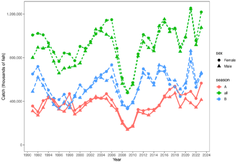

## Overview

In this report we examine the pollock fishery age data for the Gulf of Alaska (GOA) and Bering Sea and Aleutian Islands (BSAI). 
These data are parsed based on R scripts presented below  covering data from e1986-2025. 
@fig-catch-sex-season provides context for sex-specific differences in fishery catch prior to the age and length analyses 
based on appriately raised estimates of catch-at-age by sex and season (Ianelli et al. 2024).
The figure indicates slight variability in  sex-specific structure in catch across years but without a strong
indication that the sex-ratio deviates consistently from year to year.
These patterns motivate explicit sex-specific summaries in the subsequent age- and length-based diagnostics.

{#fig-catch-sex-season fig-alt="Time series of EBS pollock catch by female and male fish across A season, B season, and total catch."}


## Setup

```{r}
#| label: setup
#| include: false
#library(dplyr)
library(tidyverse)
library(patchwork)
library(readr)
library(scales)
```

```{r}
#| label: load-df-age
#| include: false
#| cache: true
#| cache.extra: !expr file.info("age1986-2025.csv")$mtime

df_age_big <- read_csv("age1986-2025.csv", show_col_types = FALSE)
df_age <- df_age_big |>
  mutate(
    subarea = case_when(
      NMFS_AREA == 610 ~ "WGOA",
      NMFS_AREA < 520 ~ "SE_BS",
      dplyr::between(NMFS_AREA, 520, 539) ~ "NW_BS",
      dplyr::between(NMFS_AREA, 620, 630) ~ "CGOA",
      dplyr::between(NMFS_AREA, 540, 549) ~ "AI",
      TRUE ~ NA_character_
    ),
    season = if_else(month(HAUL_OFFLOAD_DATE) < 6, "A", "B"),
    fmp = if_else(NMFS_AREA < 600, "BSAI", "GOA")
  ) |>
  select(YEAR, season, fmp, subarea, SEX, AGE, LENGTH)

```

```{r}
#| label: plot-function
filter_plot_data <- function(data, season_filter = NULL, fmp_filter = NULL) {
  data <- data %>%
    filter(SEX %in% c("F", "M"))

  if (!is.null(season_filter)) {
    data <- data %>%
      filter(season %in% season_filter)
  }

  if (!is.null(fmp_filter)) {
    data <- data %>%
      filter(fmp %in% fmp_filter)
  }

  data
}

summarize_sex_ratio <- function(data, group_vars) {
  data %>%
    group_by(!!!group_vars) %>%
    summarize(
      female_n = sum(SEX == "F"),
      male_n = sum(SEX == "M"),
      total_n = female_n + male_n,
      sex_ratio = female_n / total_n,
      .groups = "drop"
    )
}

build_facet_vars <- function(primary_facet = NULL, facet_season = FALSE, facet_fmp = FALSE) {
  facet_vars <- list()

  if (!is.null(primary_facet) && !rlang::quo_is_null(primary_facet)) {
    facet_vars <- c(facet_vars, list(primary_facet))
  }

  if (facet_season) {
    facet_vars <- c(facet_vars, rlang::quos(season))
  }

  if (facet_fmp) {
    facet_vars <- c(facet_vars, rlang::quos(fmp))
  }

  facet_vars
}

plot_sex_ratio <- function(data, x_var, facet_var = NULL, min_n = 5,
                           y_limits = c(0.3, 0.7), show_labels = FALSE,
                           facet_ncol = 6, season_filter = NULL,
                           fmp_filter = NULL, facet_season = FALSE,
                           facet_fmp = FALSE, color_var = NULL) {
  x_var <- rlang::enquo(x_var)
  facet_var <- rlang::enquo(facet_var)
  facet_vars <- build_facet_vars(facet_var, facet_season = facet_season, facet_fmp = facet_fmp)
  color_sym <- if (is.null(color_var)) NULL else rlang::sym(color_var)
  group_vars <- c(facet_vars, list(x_var), if (is.null(color_sym)) list() else list(color_sym))

  plot_df <- data %>%
    filter_plot_data(season_filter = season_filter, fmp_filter = fmp_filter) %>%
    summarize_sex_ratio(group_vars) %>%
    filter(total_n >= min_n)

  plot_mapping <- aes(x = !!x_var, y = sex_ratio)
  if (!is.null(color_sym)) {
    plot_mapping$colour <- color_sym
  }
  color_label <- if (is.null(color_var)) {
    NULL
  } else {
    dplyr::case_match(
      color_var,
      "season" ~ "Season",
      "fmp" ~ "FMP",
      .default = color_var
    )
  }

  p <- ggplot(plot_df, plot_mapping)

  if (show_labels) {
    p <- p +
      geom_text(
        aes(label = round(total_n / 100, 1)),
        size = 2.8,
        alpha = 0.8,
        check_overlap = TRUE
      )
  } else {
    p <- p +
      geom_point(aes(size = total_n), alpha = 0.6)
  }

  p <- p +
    geom_smooth(method = "loess", formula = "y ~ x") +
    geom_hline(yintercept = 0.5, linetype = "dashed", color = "gray50") +
    scale_y_continuous(labels = scales::percent, limits = y_limits) +
    labs(
      title = paste("Sex Ratio (Proportion Female) by", rlang::as_label(x_var)),
      subtitle = if (show_labels) "Labels show Sample Size / 100" else "Points sized by sample size",
      x = rlang::as_label(x_var),
      y = "Sex Ratio",
      size = "Sample Size",
      color = color_label
    ) +
    theme_minimal(base_size = 11)

  if (length(facet_vars) > 0) {
    p <- p + facet_wrap(vars(!!!facet_vars), ncol = facet_ncol)
  }

  p
}

plot_sex_ratio_age_box <- function(data, min_n = 25, y_limits = c(0.3, 0.7),
                                   facet_ncol = 6, season_filter = NULL,
                                   fmp_filter = NULL, facet_season = FALSE,
                                   facet_fmp = FALSE) {
  facet_vars <- build_facet_vars(facet_season = facet_season, facet_fmp = facet_fmp)
  group_vars <- c(facet_vars, rlang::quos(age_group))

  plot_df <- data %>%
    filter_plot_data(season_filter = season_filter, fmp_filter = fmp_filter) %>%
    mutate(
      age_group = if_else(AGE > 13, "13+", as.character(AGE))
    ) %>%
    summarize_sex_ratio(group_vars) %>%
    filter(total_n >= min_n)

  numeric_ages <- suppressWarnings(as.integer(plot_df$age_group[plot_df$age_group != "13+"]))
  age_levels <- c(
    as.character(sort(unique(numeric_ages[!is.na(numeric_ages)]))),
    if (any(plot_df$age_group == "13+")) "13+" else character(0)
  )
  plot_df <- plot_df %>%
    mutate(
      age_group = factor(age_group, levels = age_levels),
      age_num = if_else(age_group == "13+", 13, as.numeric(as.character(age_group)))
    )

  p <- ggplot(plot_df, aes(x = age_num, y = sex_ratio)) +
    geom_point(aes(size = total_n), alpha = 0.5) +
    geom_smooth(method = "loess", formula = "y ~ x") +
    geom_hline(yintercept = 0.5, linetype = "dashed", color = "gray50") +
    scale_y_continuous(labels = scales::percent, limits = y_limits) +
    scale_x_continuous(
      breaks = c(as.integer(age_levels[age_levels != "13+"]), if ("13+" %in% age_levels) 13 else numeric(0)),
      labels = age_levels
    ) +
    labs(
      x = "Age (13+ pooled)",
      y = "Sex Ratio",
      size = "Sample Size"
    ) +
    theme_minimal(base_size = 11)

  if (length(facet_vars) > 0) {
    p <- p + facet_wrap(vars(!!!facet_vars), ncol = facet_ncol)
  }

  p
}

plot_sex_ratio_length_box <- function(data, bin_width = 5, min_n = 50,
                                      y_limits = c(0.3, 0.7), facet_ncol = 6,
                                      season_filter = NULL, fmp_filter = NULL,
                                      facet_season = FALSE, facet_fmp = FALSE) {
  facet_vars <- build_facet_vars(facet_season = facet_season, facet_fmp = facet_fmp)
  group_vars <- c(facet_vars, rlang::quos(length_bin_lower))

  plot_df <- data %>%
    filter_plot_data(season_filter = season_filter, fmp_filter = fmp_filter) %>%
    filter(LENGTH >= 20, LENGTH <= 65) %>%
    mutate(
      length_bin_lower = pmin(floor((LENGTH - 20) / bin_width) * bin_width + 20, 60)
    ) %>%
    summarize_sex_ratio(group_vars) %>%
    filter(total_n >= min_n) %>%
    mutate(
      length_bin_mid = if_else(length_bin_lower == 60, 62.5, length_bin_lower + bin_width / 2),
      length_bin = if_else(
        length_bin_lower == 60,
        "60-65",
        paste0(length_bin_lower, "-", length_bin_lower + (bin_width - 1))
      ),
      length_bin = factor(length_bin, levels = unique(length_bin[order(length_bin_lower)]))
    )

  p <- ggplot(plot_df, aes(x = length_bin_mid, y = sex_ratio)) +
    geom_point(aes(size = total_n), alpha = 0.5) +
    geom_smooth(method = "loess", formula = "y ~ x") +
    geom_hline(yintercept = 0.5, linetype = "dashed", color = "gray50") +
    scale_y_continuous(labels = scales::percent, limits = y_limits) +
    scale_x_continuous(
      breaks = unique(plot_df$length_bin_mid[order(plot_df$length_bin_lower)]),
      labels = unique(plot_df$length_bin[order(plot_df$length_bin_lower)])
    ) +
    labs(
      x = "Length Bin (cm, 20-65)",
      y = "Sex Ratio",
      size = "Sample Size"
    ) +
    theme_minimal(base_size = 11) +
    theme(axis.text.x = element_text(angle = 45, hjust = 1))

  if (length(facet_vars) > 0) {
    p <- p + facet_wrap(vars(!!!facet_vars), ncol = facet_ncol)
  }

  p
}

plot_mean_length_age_sex <- function(data, age_range = 2:10, facet_ncol = 6,
                                     season_filter = NULL, fmp_filter = NULL,
                                     facet_season = FALSE, facet_fmp = FALSE,
                                     facet_sex = FALSE, color_var = "sex",
                                     shape_var = NULL, facet_rows = NULL,
                                     facet_cols = NULL, linetype_var = NULL) {
  facet_names <- c(
    if (facet_season) "season",
    if (facet_fmp) "fmp",
    if (facet_sex) "sex"
  )
  facet_grid_names <- c(facet_rows, facet_cols)
  group_names <- unique(c(facet_names, facet_grid_names, "age_num", "sex", color_var, shape_var, linetype_var))

  plot_df <- data %>%
    filter_plot_data(season_filter = season_filter, fmp_filter = fmp_filter) %>%
    filter(!is.na(AGE), !is.na(LENGTH)) %>%
    mutate(
      age_num = as.numeric(AGE),
      sex = recode(SEX, F = "Female", M = "Male")
    ) %>%
    filter(age_num >= min(age_range), age_num <= max(age_range)) %>%
    group_by(across(all_of(group_names))) %>%
    summarize(
      mean_length = mean(LENGTH, na.rm = TRUE),
      .groups = "drop"
    )

  plot_mapping <- aes(x = age_num, y = mean_length)
  plot_mapping$colour <- rlang::sym(color_var)

  if (!is.null(shape_var)) {
    plot_mapping$shape <- rlang::sym(shape_var)
  }

  if (!is.null(linetype_var)) {
    plot_mapping$linetype <- rlang::sym(linetype_var)
  }

  line_group_names <- unique(c(color_var, shape_var, linetype_var, if (!facet_sex) "sex"))
  plot_mapping$group <- rlang::expr(interaction(!!!rlang::syms(line_group_names), drop = TRUE))
  color_label <- dplyr::case_match(
    color_var,
    "sex" ~ "Sex",
    "season" ~ "Season",
    "fmp" ~ "FMP",
    .default = color_var
  )
  shape_label <- if (is.null(shape_var)) {
    NULL
  } else {
    dplyr::case_match(
      shape_var,
      "sex" ~ "Sex",
      "season" ~ "Season",
      "fmp" ~ "FMP",
      .default = shape_var
    )
  }
  linetype_label <- if (is.null(linetype_var)) {
    NULL
  } else {
    dplyr::case_match(
      linetype_var,
      "sex" ~ "Sex",
      "season" ~ "Season",
      "fmp" ~ "FMP",
      .default = linetype_var
    )
  }

  p <- ggplot(plot_df, plot_mapping) +
    geom_point(size = 2.4, alpha = 0.9) +
    geom_smooth(method = "loess", formula = "y ~ x", se = FALSE, linewidth = 1.1) +
    scale_x_continuous(breaks = age_range) +
    labs(
      x = "Age",
      y = "Mean Length",
      color = color_label,
      shape = shape_label,
      linetype = linetype_label
    ) +
    theme_minimal(base_size = 11)

  if (!is.null(facet_rows) || !is.null(facet_cols)) {
    row_vars <- if (is.null(facet_rows)) list(.) else rlang::syms(facet_rows)
    col_vars <- if (is.null(facet_cols)) list(.) else rlang::syms(facet_cols)
    p <- p + facet_grid(rows = vars(!!!row_vars), cols = vars(!!!col_vars))
  } else if (length(facet_names) > 0) {
    p <- p + facet_wrap(vars(!!!rlang::syms(facet_names)), ncol = facet_ncol)
  }

  p
}
```

## Exploratory figures

### Fishery data

The all-years pooled comparisons are shown separately for GOA in @fig-sex-ratio-overall-goa and for BSAI in @fig-sex-ratio-overall-bsai. The length-based trend by year for GOA is shown in @fig-sex-ratio-length-year-goa, the corresponding BSAI view is shown in @fig-sex-ratio-length-year-bsai, age-based views by year are shown separately for GOA in @fig-sex-ratio-age-year-goa and for BSAI in @fig-sex-ratio-age-year-bsai, and younger-age-focused views are shown separately for GOA in @fig-sex-ratio-length-age-goa and for BSAI in @fig-sex-ratio-length-age-bsai; the seasonal pattern is broadly similar between GOA and BSAI, but in both areas the age-4 panels suggest that fish sampled in the A season tend to be slightly larger than those sampled in the B season, which is somewhat counterintuitive. A Season B comparison of SE_BS versus NW_BS is shown in @fig-sex-ratio-length-age-sebs-nwbs-b, and a Season B comparison of SE_BS versus WGOA for ages 3-10 is shown in @fig-sex-ratio-length-age-subarea-season. Corresponding mean length-at-age views split by fishery management program are shown in @fig-mean-length-age-sex-fmp and @fig-mean-length-age-sex-season-fmp.

```{r}
#| label: fig-sex-ratio-overall-goa
#| fig-cap: "GOA pooled sex ratios across all samples: by age with ages >13 pooled to 13+ (top) and by 5-cm length bins for lengths 20-65 cm (bottom)."
#| fig-width: 10
#| fig-height: 12

p_age_overall <- plot_sex_ratio_age_box(df_age, min_n = 25, fmp_filter = "GOA") +
  labs(title = "GOA: By Age (All Samples Pooled)")

p_length_overall <- plot_sex_ratio_length_box(df_age, bin_width = 5, min_n = 50, fmp_filter = "GOA") +
  labs(title = "GOA: By Length (All Samples Pooled)")

p_age_overall / p_length_overall + patchwork::plot_layout(heights = c(1, 1))
```

```{r}
#| label: fig-sex-ratio-overall-bsai
#| fig-cap: "BSAI pooled sex ratios across all samples: by age with ages >13 pooled to 13+ (top) and by 5-cm length bins for lengths 20-65 cm (bottom)."
#| fig-width: 10
#| fig-height: 12

p_age_overall <- plot_sex_ratio_age_box(df_age, min_n = 25, fmp_filter = "BSAI") +
  labs(title = "BSAI: By Age (All Samples Pooled)")

p_length_overall <- plot_sex_ratio_length_box(df_age, bin_width = 5, min_n = 50, fmp_filter = "BSAI") +
  labs(title = "BSAI: By Length (All Samples Pooled)")

p_age_overall / p_length_overall + patchwork::plot_layout(heights = c(1, 1))
```

```{r}
#| label: fig-sex-ratio-length-year-goa
#| fig-cap: "Sex ratio (proportion female) by 5-cm length bins for GOA, faceted by year with season shown by color (YEAR > 2000; min_n = 100)."
#| fig-width: 12
#| fig-height: 14

df_age %>%
  filter(YEAR > 2000, LENGTH >= 20, LENGTH <= 65) %>%
  mutate(length_bin_mid = if_else(
    pmin(floor((LENGTH - 20) / 5) * 5 + 20, 60) == 60,
    62.5,
    pmin(floor((LENGTH - 20) / 5) * 5 + 20, 60) + 2.5
  )) %>%
  plot_sex_ratio(
    x_var = length_bin_mid,
    facet_var = YEAR,
    min_n = 100,
    show_labels = FALSE,
    facet_ncol = 5,
    fmp_filter = "GOA",
    color_var = "season"
  )
```

```{r}
#| label: fig-sex-ratio-length-year-bsai
#| fig-cap: "Sex ratio (proportion female) by length for BSAI, faceted by year (YEAR > 2000; min_n = 500)."
#| fig-width: 12
#| fig-height: 14

df_age %>%
  filter(YEAR > 2000) %>%
  plot_sex_ratio(
    x_var = LENGTH,
    facet_var = YEAR,
    min_n = 500,
    show_labels = FALSE,
    facet_ncol = 5,
    fmp_filter = "BSAI"
  )
```

```{r}
#| label: fig-sex-ratio-age-year-goa
#| fig-cap: "Sex ratio (proportion female) by age for GOA, faceted by year (YEAR > 2000)."
#| fig-width: 12
#| fig-height: 14

df_age %>%
  filter(YEAR > 2000) %>%
  plot_sex_ratio(
    x_var = AGE,
    facet_var = YEAR,
    show_labels = FALSE,
    facet_ncol = 5,
    fmp_filter = "GOA"
  )
```

```{r}
#| label: fig-sex-ratio-age-year-bsai
#| fig-cap: "Sex ratio (proportion female) by age for BSAI, faceted by year (YEAR > 2000)."
#| fig-width: 12
#| fig-height: 14

df_age %>%
  filter(YEAR > 2000) %>%
  plot_sex_ratio(
    x_var = AGE,
    facet_var = YEAR,
    show_labels = FALSE,
    facet_ncol = 5,
    fmp_filter = "BSAI"
  )
```

```{r}
#| label: fig-sex-ratio-length-age-goa
#| fig-cap: "Sex ratio (proportion female) by length for GOA, faceted by age (AGE < 11), with season shown by color."
#| fig-width: 11
#| fig-height: 8

df_age %>%
  filter(AGE < 11) %>%
  plot_sex_ratio(
    x_var = LENGTH,
    facet_var = AGE,
    show_labels = FALSE,
    facet_ncol = 4,
    fmp_filter = "GOA",
    color_var = "season"
  )
```

```{r}
#| label: fig-sex-ratio-length-age-bsai
#| fig-cap: "Sex ratio (proportion female) by length for BSAI, faceted by age (AGE < 11), with season shown by color."
#| fig-width: 11
#| fig-height: 8

df_age %>%
  filter(AGE < 11) %>%
  plot_sex_ratio(
    x_var = LENGTH,
    facet_var = AGE,
    show_labels = FALSE,
    facet_ncol = 4,
    fmp_filter = "BSAI",
    color_var = "season"
  )
```

```{r}
#| label: fig-sex-ratio-length-age-sebs-nwbs-b
#| fig-cap: "Sex ratio (proportion female) by length for subareas SE_BS and NW_BS in Season B, faceted by age (AGE < 11), with subarea shown by color."
#| fig-width: 11
#| fig-height: 8

df_age %>%
  filter(AGE < 11, subarea %in% c("SE_BS", "NW_BS")) %>%
  plot_sex_ratio(
    x_var = LENGTH,
    facet_var = AGE,
    show_labels = FALSE,
    facet_ncol = 4,
    season_filter = "B",
    color_var = "subarea"
  )
```

```{r}
#| label: fig-sex-ratio-length-age-subarea-season
#| fig-cap: "Sex ratio (proportion female) by length for subareas SE_BS and WGOA in Season B, faceted by age (ages 3-10), with subarea shown by color."
#| fig-width: 11
#| fig-height: 8

subarea_compare <- df_age %>%
  filter(dplyr::between(AGE, 3, 10), subarea %in% c("SE_BS", "WGOA"))

subarea_compare %>%
  plot_sex_ratio(
    x_var = LENGTH,
    facet_var = AGE,
    show_labels = FALSE,
    facet_ncol = 4,
    season_filter = "B",
    color_var = "subarea"
  )
```

```{r}
#| label: fig-mean-length-age-sex-fmp
#| fig-cap: "Mean length by age (2-10) using records with non-missing ages, faceted by fishery management program with season shown by color and sex shown by symbol."
#| fig-width: 11
#| fig-height: 6

plot_mean_length_age_sex(
  df_age,
  facet_fmp = TRUE,
  facet_ncol = 2,
  color_var = "season",
  shape_var = "sex"
)
```

```{r}
#| label: fig-mean-length-age-sex-season-fmp
#| fig-cap: "Mean length by age (2-10) using records with non-missing ages, faceted by sex with fishery management program shown in columns and season shown by color."
#| fig-width: 12
#| fig-height: 8

plot_mean_length_age_sex(
  df_age,
  facet_rows = "sex",
  facet_cols = "fmp",
  color_var = "season",
  facet_ncol = 1
)
```


### Acoustic survey data
```{r}
#| label: load-df-acoustic-age
#| include: false
#| cache: true
#| cache.extra: !expr file.info("hydro_pollock_BS_GOA_1993_2025.csv")$mtime

df_acoust_big <- read_csv("hydro_pollock_BS_GOA_1993_2025.csv", show_col_types = FALSE)

names(df_acoust_big)
#unique(df_acoust_big$collection_type)
#unique(df_acoust_big$sex)
#unique(df_acoust_big$region)
df_acoust <- df_acoust_big |>
  mutate(
    SEX = if_else(sex == 1, "M", if_else(sex==2,"F","U")),
    fmp = if_else(region == "GOA", "GOA", "BSAI"),
    YEAR = collection_year,
    LENGTH = length/10,
    AGE = final_age
  ) |>
  select(YEAR, fmp, SEX, AGE, LENGTH)

```

Within each survey subsection, the first figure shows the all-years pooled acoustic-survey sex ratios across all samples, followed by the year-specific length-based view.

#### Bering Sea summer acoustic surveys

##### Aggregated over years

```{r}
#| label: fig-acoustic-sex-ratio-overall-bsai
#| fig-cap: "BSAI pooled acoustic-survey sex ratios across all samples: by age with ages >13 pooled to 13+ (top) and by 5-cm length bins for lengths 20-65 cm (bottom)."
#| fig-width: 10
#| fig-height: 12

p_age_overall <- df_acoust %>%
  filter(!is.na(AGE)) %>%
  plot_sex_ratio_age_box(min_n = 25, fmp_filter = "BSAI") +
  labs(title = "BSAI Acoustic Survey: By Age (All Samples Pooled)")

p_length_overall <- plot_sex_ratio_length_box(df_acoust, bin_width = 5, min_n = 25, fmp_filter = "BSAI") +
  labs(title = "BSAI Acoustic Survey: By Length (All Samples Pooled)")

p_age_overall / p_length_overall + patchwork::plot_layout(heights = c(1, 1))
```

##### By year

```{r}
#| label: fig-acoustic-sex-ratio-length-year-bsai
#| fig-cap: "Acoustic survey sex ratio (proportion female) by 5-cm length bins for BSAI, faceted by year (1993-2024; min_n = 25)."
#| fig-width: 12
#| fig-height: 16

df_acoust %>%
  filter(LENGTH >= 20, LENGTH <= 65) %>%
  mutate(length_bin_mid = if_else(
    pmin(floor((LENGTH - 20) / 5) * 5 + 20, 60) == 60,
    62.5,
    pmin(floor((LENGTH - 20) / 5) * 5 + 20, 60) + 2.5
  )) %>%
  plot_sex_ratio(
    x_var = length_bin_mid,
    facet_var = YEAR,
    min_n = 25,
    show_labels = FALSE,
    facet_ncol = 5,
    fmp_filter = "BSAI"
  )
```


#### GOA winter acoustic surveys

##### Aggregated over years

```{r}
#| label: fig-acoustic-sex-ratio-overall-goa
#| fig-cap: "GOA pooled acoustic-survey sex ratios across all samples: by age with ages >13 pooled to 13+ (top) and by 5-cm length bins for lengths 20-65 cm (bottom)."
#| fig-width: 10
#| fig-height: 12

p_age_overall <- df_acoust %>%
  filter(!is.na(AGE)) %>%
  plot_sex_ratio_age_box(min_n = 25, fmp_filter = "GOA") +
  labs(title = "GOA Acoustic Survey: By Age (All Samples Pooled)")

p_length_overall <- plot_sex_ratio_length_box(df_acoust, bin_width = 5, min_n = 25, fmp_filter = "GOA") +
  labs(title = "GOA Acoustic Survey: By Length (All Samples Pooled)")

p_age_overall / p_length_overall + patchwork::plot_layout(heights = c(1, 1))
```

##### By year

```{r}
#| label: fig-acoustic-sex-ratio-length-year-goa
#| fig-cap: "Acoustic survey sex ratio (proportion female) by 5-cm length bins for GOA, faceted by year (1993-2025; min_n = 25)."
#| fig-width: 12
#| fig-height: 16

df_acoust %>%
  filter(LENGTH >= 20, LENGTH <= 65) %>%
  mutate(length_bin_mid = if_else(
    pmin(floor((LENGTH - 20) / 5) * 5 + 20, 60) == 60,
    62.5,
    pmin(floor((LENGTH - 20) / 5) * 5 + 20, 60) + 2.5
  )) %>%
  plot_sex_ratio(
    x_var = length_bin_mid,
    facet_var = YEAR,
    min_n = 25,
    show_labels = FALSE,
    facet_ncol = 5,
    fmp_filter = "GOA"
  )
```


## Methods

To keep the Bayesian analysis tractable within a renderable Quarto workflow, the fitted models below use cell-aggregated data rather than all 1.4 million individual observations. The key design choice from the EDA is retained: `fmp` is treated as the primary split category, and separate models are fit for `GOA` and `BSAI`.

For sex ratio, the aggregated response is female count out of total `F + M` count within `YEAR x season x subarea x age x 5-cm length-bin` cells, excluding records coded `U`. Age 4 is used as the reference category so that the `seasonB` term is directly interpretable as the age-4 B-versus-A contrast after adjusting for length, year, and subarea. For growth, the aggregated response is mean length with its standard error within `YEAR x season x subarea x sex x age` cells, fit as a Gaussian measurement-error model. In both cases, the reduced formulation preserves the main contrasts of interest from the EDA: season, age, sex, year, subarea, and their comparison between `GOA` and `BSAI`.

The implemented `brms` data preparation was:

```{r}
#| label: model-data-code
#| eval: false
df_model <- df_age %>%
  filter(!is.na(SEX), !is.na(AGE), !is.na(LENGTH), !is.na(subarea))

sex_model_data <- df_model %>%
  filter(SEX %in% c("F", "M"), LENGTH >= 20, LENGTH <= 65) %>%
  mutate(
    female = if_else(SEX == "F", 1L, 0L),
    age_group = relevel(factor(pmin(as.integer(AGE), 13L)), ref = "4"),
    length_bin = pmin(floor((LENGTH - 20) / 5) * 5 + 20, 60),
    length_mid = if_else(length_bin == 60, 62.5, length_bin + 2.5)
  ) %>%
  group_by(fmp, YEAR, season, subarea, age_group, length_bin, length_mid) %>%
  summarise(female = sum(female), total_n = n(), .groups = "drop")

growth_model_data <- df_model %>%
  filter(SEX %in% c("F", "M"), AGE >= 2, AGE <= 10) %>%
  mutate(
    age_group = relevel(factor(as.integer(AGE)), ref = "4"),
    sex = relevel(factor(SEX), ref = "F")
  ) %>%
  group_by(fmp, YEAR, season, subarea, sex, age_group) %>%
  summarise(mean_length = mean(LENGTH), sd_length = sd(LENGTH), n = n(), .groups = "drop") %>%
  mutate(se_length = sd_length / sqrt(n)) %>%
  filter(is.finite(se_length), n >= 5)
```

The implemented `brms` model formulas were:

```{r}
#| label: sex-model-code
#| eval: false
sex_formula <- bf(
  female | trials(total_n) ~ season * age_group + length_sc + year_sc + subarea
)

fit_sex_goa <- brm(
  sex_formula,
  data = filter(sex_model_data, fmp == "GOA"),
  family = binomial(),
  backend = "cmdstanr"
)

fit_sex_bsai <- brm(
  sex_formula,
  data = filter(sex_model_data, fmp == "BSAI"),
  family = binomial(),
  backend = "cmdstanr"
)
```

```{r}
#| label: growth-model-code
#| eval: false
growth_formula <- bf(
  mean_length | se(se_length, sigma = TRUE) ~
    sex + season * age_group + sex:age_group + year_sc + subarea
)

fit_growth_goa <- brm(
  growth_formula,
  data = filter(growth_model_data, fmp == "GOA"),
  family = gaussian(),
  backend = "cmdstanr"
)

fit_growth_bsai <- brm(
  growth_formula,
  data = filter(growth_model_data, fmp == "BSAI"),
  family = gaussian(),
  backend = "cmdstanr"
)
```

```{r}
#| label: fit-brms-models
#| include: false
#| cache: true
#| cache.extra: !expr paste(file.info("age1986-2025.csv")$mtime, as.character(packageVersion("brms")), as.character(packageVersion("cmdstanr")))
library(brms)
library(gt)

options(mc.cores = 2)
dir.create("model_fits", showWarnings = FALSE)

sex_model_data <- df_age %>%
  filter(SEX %in% c("F", "M"), !is.na(AGE), !is.na(LENGTH), !is.na(subarea), LENGTH >= 20, LENGTH <= 65) %>%
  mutate(
    age_group = pmin(as.integer(AGE), 13L),
    age_group = factor(age_group),
    age_group = stats::relevel(age_group, ref = "4"),
    length_bin = pmin(floor((LENGTH - 20) / 5) * 5 + 20, 60),
    length_mid = if_else(length_bin == 60, 62.5, length_bin + 2.5),
    female = if_else(SEX == "F", 1L, 0L)
  ) %>%
  group_by(fmp, YEAR, season, subarea, age_group, length_bin, length_mid) %>%
  summarise(female = sum(female), total_n = n(), .groups = "drop") %>%
  mutate(
    season = factor(season),
    subarea = factor(subarea),
    year_sc = as.numeric(scale(YEAR)),
    length_sc = as.numeric(scale(length_mid))
  )

growth_model_data <- df_age %>%
  filter(SEX %in% c("F", "M"), !is.na(AGE), !is.na(LENGTH), !is.na(subarea), AGE >= 2, AGE <= 10) %>%
  mutate(
    age_group = factor(as.integer(AGE)),
    age_group = stats::relevel(age_group, ref = "4"),
    sex = factor(SEX),
    sex = stats::relevel(sex, ref = "F")
  ) %>%
  group_by(fmp, YEAR, season, subarea, sex, age_group) %>%
  summarise(mean_length = mean(LENGTH), sd_length = sd(LENGTH), n = n(), .groups = "drop") %>%
  mutate(se_length = sd_length / sqrt(n)) %>%
  filter(is.finite(se_length), n >= 5) %>%
  mutate(
    season = factor(season),
    subarea = factor(subarea),
    year_sc = as.numeric(scale(YEAR))
  )

sex_goa_data <- droplevels(filter(sex_model_data, fmp == "GOA"))
sex_bsai_data <- droplevels(filter(sex_model_data, fmp == "BSAI"))
growth_goa_data <- droplevels(filter(growth_model_data, fmp == "GOA"))
growth_bsai_data <- droplevels(filter(growth_model_data, fmp == "BSAI"))

sex_formula <- bf(female | trials(total_n) ~ season * age_group + length_sc + year_sc + subarea)
growth_formula <- bf(mean_length | se(se_length, sigma = TRUE) ~ sex + season * age_group + sex:age_group + year_sc + subarea)

fit_sex_goa <- brm(
  sex_formula,
  data = sex_goa_data,
  family = binomial(),
  backend = "cmdstanr",
  chains = 2,
  iter = 1000,
  warmup = 500,
  refresh = 0,
  seed = 123,
  file = "model_fits/fit_sex_goa",
  file_refit = "on_change"
)

fit_sex_bsai <- brm(
  sex_formula,
  data = sex_bsai_data,
  family = binomial(),
  backend = "cmdstanr",
  chains = 2,
  iter = 1000,
  warmup = 500,
  refresh = 0,
  seed = 123,
  file = "model_fits/fit_sex_bsai",
  file_refit = "on_change"
)

fit_growth_goa <- brm(
  growth_formula,
  data = growth_goa_data,
  family = gaussian(),
  backend = "cmdstanr",
  chains = 2,
  iter = 1000,
  warmup = 500,
  refresh = 0,
  seed = 123,
  file = "model_fits/fit_growth_goa",
  file_refit = "on_change"
)

fit_growth_bsai <- brm(
  growth_formula,
  data = growth_bsai_data,
  family = gaussian(),
  backend = "cmdstanr",
  chains = 2,
  iter = 1000,
  warmup = 500,
  refresh = 0,
  seed = 123,
  file = "model_fits/fit_growth_bsai",
  file_refit = "on_change"
)

summarize_draws_simple <- function(x) {
  tibble(
    median = median(x),
    lower = quantile(x, 0.025),
    upper = quantile(x, 0.975)
  )
}

sex_age4_prob_contrast <- function(fit, data) {
  base <- data %>% filter(age_group == "4")
  new_a <- base %>% mutate(season = factor("A", levels = levels(base$season)))
  new_b <- base %>% mutate(season = factor("B", levels = levels(base$season)))
  p_a <- posterior_linpred(fit, newdata = new_a, transform = TRUE)
  p_b <- posterior_linpred(fit, newdata = new_b, transform = TRUE)
  rowMeans(p_b) - rowMeans(p_a)
}

growth_age4_season_contrast <- function(fit, data) {
  base <- data %>% filter(age_group == "4")
  new_a <- base %>% mutate(season = factor("A", levels = levels(base$season)))
  new_b <- base %>% mutate(season = factor("B", levels = levels(base$season)))
  mu_a <- posterior_epred(fit, newdata = new_a)
  mu_b <- posterior_epred(fit, newdata = new_b)
  rowMeans(mu_b) - rowMeans(mu_a)
}

growth_age4_sex_contrast <- function(fit, data) {
  base <- data %>% filter(age_group == "4")
  new_f <- base %>% mutate(sex = factor("F", levels = levels(base$sex)))
  new_m <- base %>% mutate(sex = factor("M", levels = levels(base$sex)))
  mu_f <- posterior_epred(fit, newdata = new_f)
  mu_m <- posterior_epred(fit, newdata = new_m)
  rowMeans(mu_m) - rowMeans(mu_f)
}

sex_goa_age4_season_draws <- sex_age4_prob_contrast(fit_sex_goa, sex_goa_data)
sex_bsai_age4_season_draws <- sex_age4_prob_contrast(fit_sex_bsai, sex_bsai_data)
growth_goa_age4_season_draws <- growth_age4_season_contrast(fit_growth_goa, growth_goa_data)
growth_bsai_age4_season_draws <- growth_age4_season_contrast(fit_growth_bsai, growth_bsai_data)
growth_goa_age4_sex_draws <- growth_age4_sex_contrast(fit_growth_goa, growth_goa_data)
growth_bsai_age4_sex_draws <- growth_age4_sex_contrast(fit_growth_bsai, growth_bsai_data)

contrast_summary <- bind_rows(
  summarize_draws_simple(sex_goa_age4_season_draws) %>% mutate(contrast = "Age-4 female probability: Season B - A", fmp = "GOA", scale = "prob"),
  summarize_draws_simple(sex_bsai_age4_season_draws) %>% mutate(contrast = "Age-4 female probability: Season B - A", fmp = "BSAI", scale = "prob"),
  summarize_draws_simple(growth_goa_age4_season_draws) %>% mutate(contrast = "Age-4 mean length: Season B - A", fmp = "GOA", scale = "cm"),
  summarize_draws_simple(growth_bsai_age4_season_draws) %>% mutate(contrast = "Age-4 mean length: Season B - A", fmp = "BSAI", scale = "cm"),
  summarize_draws_simple(growth_goa_age4_sex_draws) %>% mutate(contrast = "Age-4 mean length: Male - Female", fmp = "GOA", scale = "cm"),
  summarize_draws_simple(growth_bsai_age4_sex_draws) %>% mutate(contrast = "Age-4 mean length: Male - Female", fmp = "BSAI", scale = "cm")
) %>%
  mutate(
    estimate_display = if_else(scale == "prob", scales::percent(median, accuracy = 0.1), paste0(sprintf("%.2f", median), " cm")),
    cri_display = if_else(
      scale == "prob",
      paste0(scales::percent(lower, accuracy = 0.1), " to ", scales::percent(upper, accuracy = 0.1)),
      paste0(sprintf("%.2f", lower), " to ", sprintf("%.2f", upper), " cm")
    )
  )

contrast_draws <- bind_rows(
  tibble(fmp = "GOA", contrast = "Sex ratio: age-4 Season B - A (percentage points)", value = sex_goa_age4_season_draws * 100),
  tibble(fmp = "BSAI", contrast = "Sex ratio: age-4 Season B - A (percentage points)", value = sex_bsai_age4_season_draws * 100),
  tibble(fmp = "GOA", contrast = "Growth: age-4 Season B - A (cm)", value = growth_goa_age4_season_draws),
  tibble(fmp = "BSAI", contrast = "Growth: age-4 Season B - A (cm)", value = growth_bsai_age4_season_draws),
  tibble(fmp = "GOA", contrast = "Growth: age-4 Male - Female (cm)", value = growth_goa_age4_sex_draws),
  tibble(fmp = "BSAI", contrast = "Growth: age-4 Male - Female (cm)", value = growth_bsai_age4_sex_draws)
)

extract_fixef_summary <- function(fit, fmp_label, outcome_label, keep_terms, term_labels) {
  fixef_df <- as.data.frame(fixef(fit))
  fixef_df$term <- rownames(fixef_df)
  tibble(
    outcome = outcome_label,
    fmp = fmp_label,
    term = fixef_df$term,
    label = dplyr::recode(fixef_df$term, !!!term_labels),
    estimate = fixef_df$Estimate,
    lower = fixef_df$Q2.5,
    upper = fixef_df$Q97.5
  ) %>%
    filter(term %in% keep_terms) %>%
    mutate(
      estimate_display = sprintf("%.3f", estimate),
      cri_display = paste0(sprintf("%.3f", lower), " to ", sprintf("%.3f", upper))
    )
}

coefficient_summary <- bind_rows(
  extract_fixef_summary(
    fit_sex_goa, "GOA", "Sex ratio",
    c("seasonB", "length_sc", "year_sc"),
    c(seasonB = "Season B effect at age 4", length_sc = "Length effect (scaled)", year_sc = "Year effect (scaled)")
  ),
  extract_fixef_summary(
    fit_sex_bsai, "BSAI", "Sex ratio",
    c("seasonB", "length_sc", "year_sc"),
    c(seasonB = "Season B effect at age 4", length_sc = "Length effect (scaled)", year_sc = "Year effect (scaled)")
  ),
  extract_fixef_summary(
    fit_growth_goa, "GOA", "Growth",
    c("sexM", "seasonB", "year_sc"),
    c(sexM = "Male effect at age 4", seasonB = "Season B effect at age 4", year_sc = "Year effect (scaled)")
  ),
  extract_fixef_summary(
    fit_growth_bsai, "BSAI", "Growth",
    c("sexM", "seasonB", "year_sc"),
    c(sexM = "Male effect at age 4", seasonB = "Season B effect at age 4", year_sc = "Year effect (scaled)")
  )
)

model_data_summary <- tibble(
  outcome = c("Sex ratio", "Sex ratio", "Growth", "Growth"),
  fmp = c("GOA", "BSAI", "GOA", "BSAI"),
  cells = c(nrow(sex_goa_data), nrow(sex_bsai_data), nrow(growth_goa_data), nrow(growth_bsai_data)),
  source_n = c(sum(sex_goa_data$total_n), sum(sex_bsai_data$total_n), sum(growth_goa_data$n), sum(growth_bsai_data$n)),
  subareas = c(
    paste(levels(sex_goa_data$subarea), collapse = ", "),
    paste(levels(sex_bsai_data$subarea), collapse = ", "),
    paste(levels(growth_goa_data$subarea), collapse = ", "),
    paste(levels(growth_bsai_data$subarea), collapse = ", ")
  )
)
```

## Results

The reduced Bayesian fits support treating `GOA` and `BSAI` separately rather than pooling them into a single common model. Table @tbl-model-data shows the aggregated datasets actually used in the fitted `brms` analyses.

```{r}
#| label: tbl-model-data
#| tbl-cap: "Aggregated datasets used in the brms model fits."
model_data_summary %>%
  gt::gt() %>%
  gt::cols_label(
    outcome = "Outcome",
    fmp = "FMP",
    cells = "Aggregated Cells",
    source_n = "Fish Used",
    subareas = "Subareas"
  )
```

For sex ratio, the age-4 season contrast differs materially between `GOA` and `BSAI`. The posterior median B-versus-A change in female probability at age 4 was `r contrast_summary %>% filter(contrast == "Age-4 female probability: Season B - A", fmp == "GOA") %>% pull(estimate_display)` in `GOA` (`r contrast_summary %>% filter(contrast == "Age-4 female probability: Season B - A", fmp == "GOA") %>% pull(cri_display)`), but `r contrast_summary %>% filter(contrast == "Age-4 female probability: Season B - A", fmp == "BSAI") %>% pull(estimate_display)` in `BSAI` (`r contrast_summary %>% filter(contrast == "Age-4 female probability: Season B - A", fmp == "BSAI") %>% pull(cri_display)`). That implies a clear positive seasonal shift in `GOA` sex ratio at age 4, whereas the comparable BSAI contrast overlaps zero.

For growth, the fitted models do not support the raw visual impression that age-4 fish are larger in Season A. After adjustment for age, sex, year, and subarea, the posterior median B-versus-A change in age-4 mean length was `r contrast_summary %>% filter(contrast == "Age-4 mean length: Season B - A", fmp == "GOA") %>% pull(estimate_display)` in `GOA` (`r contrast_summary %>% filter(contrast == "Age-4 mean length: Season B - A", fmp == "GOA") %>% pull(cri_display)`) and `r contrast_summary %>% filter(contrast == "Age-4 mean length: Season B - A", fmp == "BSAI") %>% pull(estimate_display)` in `BSAI` (`r contrast_summary %>% filter(contrast == "Age-4 mean length: Season B - A", fmp == "BSAI") %>% pull(cri_display)`). In both `fmp` groupings, the posterior age-4 seasonal effect is positive for Season B, which reverses the simple visual interpretation from the unadjusted EDA plots.

The fitted growth models also indicate that males are shorter than females at age 4 in both areas: `r contrast_summary %>% filter(contrast == "Age-4 mean length: Male - Female", fmp == "GOA") %>% pull(estimate_display)` in `GOA` (`r contrast_summary %>% filter(contrast == "Age-4 mean length: Male - Female", fmp == "GOA") %>% pull(cri_display)`) and `r contrast_summary %>% filter(contrast == "Age-4 mean length: Male - Female", fmp == "BSAI") %>% pull(estimate_display)` in `BSAI` (`r contrast_summary %>% filter(contrast == "Age-4 mean length: Male - Female", fmp == "BSAI") %>% pull(cri_display)`).

Table @tbl-key-contrasts summarizes the key posterior contrasts on interpretable scales, while Table @tbl-selected-coefs reports selected coefficient summaries from the separate `GOA` and `BSAI` fits. The sex-ratio coefficient table shows a positive season effect and stronger negative year trend in `GOA`, while both sex-ratio models estimate a positive length effect. The growth coefficient table shows positive Season B effects and negative male effects in both `fmp` groupings.

```{r}
#| label: tbl-key-contrasts
#| tbl-cap: "Key posterior contrasts from the separate GOA and BSAI brms fits."
contrast_summary %>%
  select(contrast, fmp, estimate_display, cri_display) %>%
  gt::gt() %>%
  gt::cols_label(
    contrast = "Contrast",
    fmp = "FMP",
    estimate_display = "Posterior Median",
    cri_display = "95% CrI"
  )
```

```{r}
#| label: tbl-selected-coefs
#| tbl-cap: "Selected coefficient summaries from the separate GOA and BSAI brms fits."
coefficient_summary %>%
  select(outcome, fmp, label, estimate_display, cri_display) %>%
  gt::gt(groupname_col = "outcome") %>%
  gt::cols_label(
    fmp = "FMP",
    label = "Parameter",
    estimate_display = "Posterior Median",
    cri_display = "95% CrI"
  )
```

The posterior marginal distributions in @fig-key-posterior-densities make the `fmp` differences more explicit. The season effect on sex ratio is clearly shifted positive in `GOA` and centered near zero in `BSAI`, whereas the growth contrasts are more similar between the two `fmp` groupings and remain positive for Season B in both cases.

```{r}
#| label: fig-key-posterior-densities
#| fig-cap: "Posterior marginal distributions for key age-4 contrasts from separate GOA and BSAI brms models."
#| fig-width: 11
#| fig-height: 10
ggplot(contrast_draws, aes(x = value, color = fmp, fill = fmp)) +
  geom_vline(xintercept = 0, linetype = "dashed", color = "gray50") +
  geom_density(alpha = 0.25) +
  facet_wrap(~contrast, scales = "free_x", ncol = 1) +
  labs(
    x = "Posterior Draw",
    y = "Density",
    color = "FMP",
    fill = "FMP"
  ) +
  theme_minimal(base_size = 11)
```

## References

- Source script: `otoliths.R` (BSAI pollock fisheries otolith selector; created 2021-03-02).
- Input data used here: `age1986-2025.csv`.
- Query workflow used to generate age data is documented in `GetAgesSql.R`.
- Ianelli, J., T. Honkalehto, S. Wassermann, A. McCarthy, S. Steinessen, C. McGilliard, and E. Siddon. 2024. *Assessment of walleye pollock in the eastern Bering Sea*. North Pacific Fishery Management Council, Anchorage, AK.
